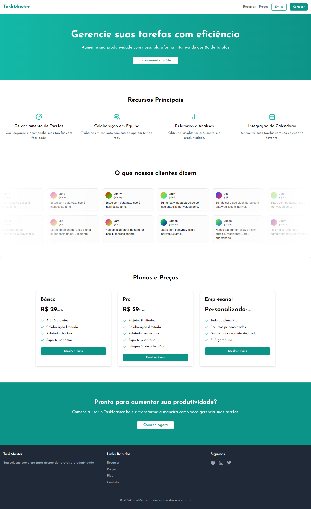

# TaskMaster - Landing Page

Bem-vindo ao repositório da **TaskMaster**, uma landing page desenvolvida para apresentar a plataforma de gestão de tarefas de forma clara, eficiente e atrativa.

## 📋 Sobre

A **TaskMaster** é uma plataforma que simplifica o gerenciamento de tarefas e otimiza a produtividade. Esta landing page tem como objetivo destacar as principais funcionalidades e converter visitantes em usuários.

## 🚀 Funcionalidades

- **Apresentação Clara**: Design responsivo e atraente.
- **Benefícios em Destaque**: Comunicação direta do valor oferecido pela plataforma.
- **Chamada para Ação (CTA)**: Botões estratégicos para incentivar cadastros e explorações.

## 🛠️ Tecnologias Utilizadas
- **Next.js**: Framework React para renderização.
- **TypeScript**: Tipagem estática para maior segurança.
- **Tailwind CSS**: Estilização rápida e eficiente.

## 🚀 Como Executar
1. Clone este repositório:
```
git clone https://github.com/gabriellucasvh/task-manager.git
```
2. Instale as dependências:
```
npm install
```
3. Inicie o servidor de desenvolvimento:
```
npm run dev
```
Acesse no navegador:
http://localhost:3000


